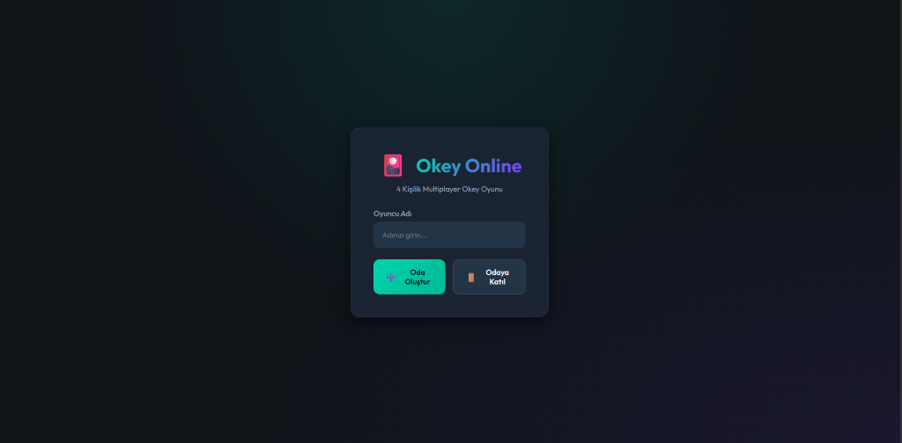
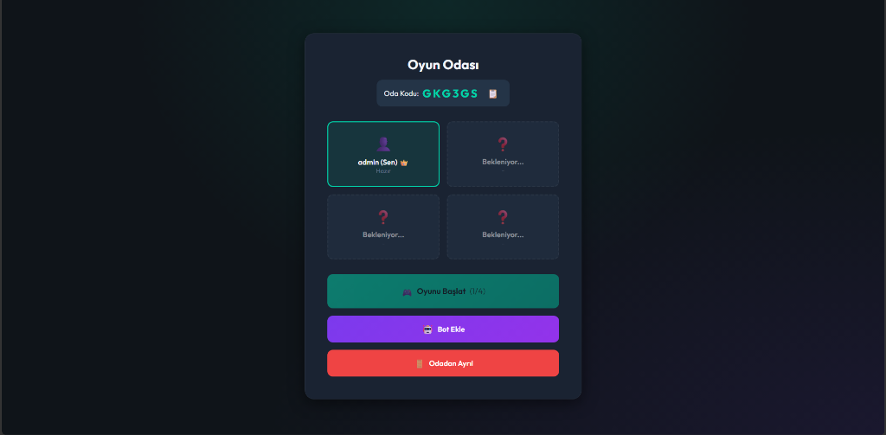
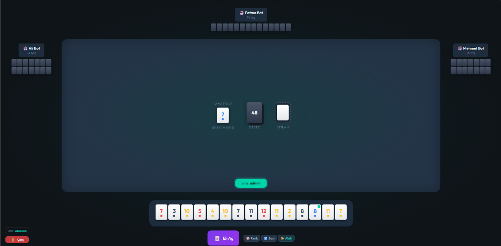
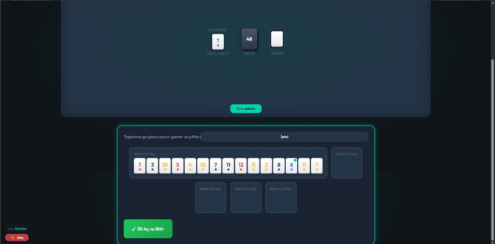

# 🎴 Okey Online — Multiplayer Okey Game

A real-time, web-based multiplayer implementation of the classic Turkish tile game **Okey**. Play with friends or challenge bot opponents — all from your browser.

### 🌐 [▶ Play Live Demo](https://okeygame-ftrt.onrender.com)


## ✨ Features

- 🎮 **Classic 4-Player Okey** — Full implementation of traditional Okey rules
- 🌐 **Real-Time Multiplayer** — Play online with friends via room codes
- 🤖 **Bot Players** — Fill empty seats with AI-powered bots
- 🃏 **Complete Tile Logic** — Runs (per), sets (seri), fake okeys, and double okeys
- 🏆 **Scoring System** — Automatic score calculation at the end of each round
- ✨ **Smart Sorting** — Sort your hand by color, number, or use smart auto-sort
- 📱 **Responsive UI** — Works on desktop and mobile browsers

## 📸 Screenshots

| Lobby | Waiting Room |
|:---:|:---:|
|  |  |

| Game Board | Hand Opening |
|:---:|:---:|
|  |  |

## 🛠️ Tech Stack

| Layer    | Technology              |
|----------|-------------------------|
| Server   | Node.js + Express       |
| Realtime | Socket.IO               |
| Frontend | Vanilla HTML/CSS/JS     |
| Font     | Google Fonts (Outfit)   |

## 📁 Project Structure

```
okey-game/
├── server/
│   ├── server.js          # Main server — Express & Socket.IO events
│   ├── gameLogic.js       # Core game engine — rules, tiles, scoring
│   ├── roomManager.js     # Room creation, joining, and management
│   └── botPlayer.js       # Bot AI — draw, discard, and hand logic
├── public/
│   ├── index.html         # Game interface — lobby, room, and board
│   ├── css/
│   │   └── styles.css     # All styling — responsive design
│   └── js/
│       ├── game.js        # Client-side game logic & socket handling
│       └── tiles.js       # Tile rendering and visual helpers
├── package.json
└── README.md
```

## 🚀 Getting Started

### Prerequisites

- [Node.js](https://nodejs.org/) v18 or higher

### Installation

```bash
# Clone the repository
git clone https://github.com/CagriGunes46/okey-game.git
cd okey-game

# Install dependencies
npm install

# Start the server
npm start
```

The game will be available at **http://localhost:3000**

## 🎲 How to Play

1. **Enter your name** on the lobby screen
2. **Create a room** or **join an existing room** using a 6-digit code
3. **Share the room code** with your friends
4. **Add bots** to fill empty seats (host only)
5. **Start the game** when all 4 seats are filled (host only)

### Game Rules

- Each player receives **14 tiles** at the start (the starting player gets 15)
- On your turn: **draw a tile** from the center pile or the discard pile
- Then **discard one tile** from your hand
- Form valid groups: **runs** (consecutive numbers, same color) or **sets** (same number, different colors)
- The **okey tile** (joker) is determined by the indicator tile and can substitute any tile
- **Open your hand** when all tiles form valid groups to win the round

## 📄 License

This project is licensed under the MIT License.

---

<br>

# 🎴 Okey Online — Çok Oyunculu Okey Oyunu

Klasik Türk taş oyunu **Okey**'in gerçek zamanlı, web tabanlı çok oyunculu versiyonu. Arkadaşlarınızla oynayın veya bot rakiplere karşı meydan okuyun — hepsi tarayıcınızdan.

### 🌐 [▶ Canlı Demo'yu Oyna](https://okeygame-ftrt.onrender.com)

## ✨ Özellikler

- 🎮 **Klasik 4 Kişilik Okey** — Geleneksel Okey kurallarının tam uygulaması
- 🌐 **Gerçek Zamanlı Çok Oyunculu** — Oda kodları ile arkadaşlarınızla çevrimiçi oynayın
- 🤖 **Bot Oyuncular** — Boş koltukları yapay zekalı botlarla doldurun
- 🃏 **Eksiksiz Taş Mantığı** — Per, seri, sahte okey ve çift okey desteği
- 🏆 **Skor Sistemi** — Her elin sonunda otomatik skor hesaplama
- ✨ **Akıllı Sıralama** — Elinizi renge, sayıya göre sıralayın veya akıllı sıralamayı kullanın
- 📱 **Duyarlı Arayüz** — Masaüstü ve mobil tarayıcılarda çalışır

## 📸 Ekran Görüntüleri

| Lobi | Bekleme Odası |
|:---:|:---:|
|  |  |

| Oyun Tahtası | El Açma |
|:---:|:---:|
|  |  |

## 🛠️ Teknoloji Yığını

| Katman       | Teknoloji               |
|--------------|-------------------------|
| Sunucu       | Node.js + Express       |
| Gerçek Zaman | Socket.IO               |
| Ön Yüz      | Saf HTML/CSS/JS         |
| Yazı Tipi    | Google Fonts (Outfit)   |

## 📁 Proje Yapısı

```
okey-game/
├── server/
│   ├── server.js          # Ana sunucu — Express ve Socket.IO olayları
│   ├── gameLogic.js       # Oyun motoru — kurallar, taşlar, puanlama
│   ├── roomManager.js     # Oda oluşturma, katılma ve yönetim
│   └── botPlayer.js       # Bot AI — çekme, atma ve el mantığı
├── public/
│   ├── index.html         # Oyun arayüzü — lobi, oda ve tahta
│   ├── css/
│   │   └── styles.css     # Tüm stiller — duyarlı tasarım
│   └── js/
│       ├── game.js        # İstemci tarafı oyun mantığı ve soket yönetimi
│       └── tiles.js       # Taş görüntüleme ve görsel yardımcılar
├── package.json
└── README.md
```

## 🚀 Başlarken

### Gereksinimler

- [Node.js](https://nodejs.org/) v18 veya üzeri

### Kurulum

```bash
# Depoyu klonlayın
git clone https://github.com/CagriGunes46/okey-game.git
cd okey-game

# Bağımlılıkları yükleyin
npm install

# Sunucuyu başlatın
npm start
```

Oyun **http://localhost:3000** adresinde erişilebilir olacaktır.

## 🎲 Nasıl Oynanır

1. Lobi ekranında **adınızı girin**
2. **Oda oluşturun** veya 6 haneli kod ile **mevcut bir odaya katılın**
3. **Oda kodunu arkadaşlarınızla paylaşın**
4. Boş koltukları doldurmak için **bot ekleyin** (sadece oda sahibi)
5. 4 koltuk dolduğunda **oyunu başlatın** (sadece oda sahibi)

### Oyun Kuralları

- Her oyuncu başlangıçta **14 taş** alır (başlayan oyuncu 15 alır)
- Sıranızda: Orta desteden veya atılan taşlardan **bir taş çekin**
- Ardından elinizden **bir taş atın**
- Geçerli gruplar oluşturun: **Per** (ardışık sayılar, aynı renk) veya **Seri** (aynı sayı, farklı renkler)
- **Okey taşı** (joker) gösterge taşına göre belirlenir ve herhangi bir taşın yerine geçebilir
- Tüm taşlarınız geçerli gruplar oluşturduğunda **elinizi açın** ve eli kazanın

## 📄 Lisans

Bu proje MIT Lisansı altında lisanslanmıştır.
